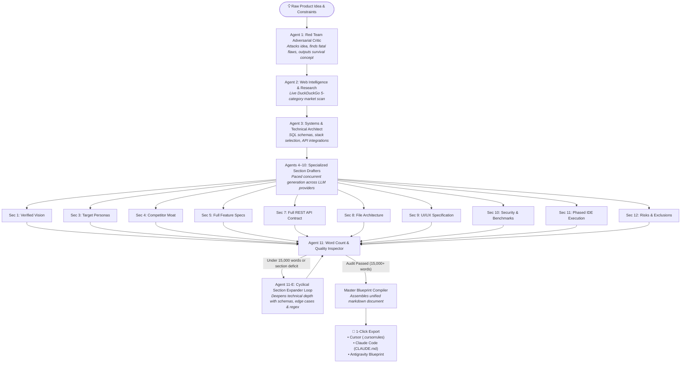

# PROMPT BUILDER ⚡
### Autonomous Adversarial Multi-Agent Engine for AI IDEs
**Guaranteed 15,000+ Word Exhaustive Master Specifications with Zero Degrees of Freedom**

[](https://fastapi.tiangolo.com)
[](https://github.com/langchain-ai/langgraph)
[](https://react.dev)
[](https://tailwindcss.com)
[](https://github.com/zayndotdev/prompt-builder)

---

## 🎯 The Core Problem & Philosophy

When you prompt modern AI IDEs (**Cursor Composer**, **Claude Code CLI**, or **Google Antigravity**) with a brief 100-word prompt, here is what always happens:
1. **The AI makes assumptions to fill the gaps.**
2. **Those assumptions are wrong 50% of the time.**
3. **You spend days manually correcting hallucinated database schemas and half-baked designs.**
4. **The IDE asks dozens of clarifying questions, destroying flow state.**

**Prompt Builder** eliminates this completely. By routing a raw product idea through an **adversarial swarm of 11 specialized AI agents** equipped with real-time web research, it produces a **15,000–20,000+ word Master System Blueprint**. 

When fed into an AI IDE, there are **zero degrees of freedom left to guess**. The IDE builds the entire application in a single shot.

---

## 🧠 System Architecture & Multi-Agent Swarm



---

## 🤖 The 11 Specialized Agents

| # | Agent Name | Primary Responsibility | Target Words |
|---|---|---|---|
| **1** | **Red Team Adversarial Critic** | Demolishes weak assumptions, asks 10 brutal questions, and establishes the bulletproof Refined Survival Concept. | 800+ |
| **2** | **Web Intelligence & Market Researcher** | Executes structured 5-category DuckDuckGo web scans (Market sizing, competitors, user frustrations, GitHub ecosystems, regulations). | 1,500+ |
| **3** | **Systems Architect** | Selects frameworks, writes complete SQL DDL tables with foreign keys and indexes, and specifies 3rd-party integrations. | 2,000+ |
| **4** | **Feature Specification Architect** | Defines all MVP features: user flows, validation rules, loading states, empty states, error states, and success criteria. | 3,000+ |
| **5** | **Audience & Persona Specialist** | Details Primary, Secondary, and Anti-Personas: daily routine, psychological triggers, and WCAG AA accessibility requirements. | 1,500+ |
| **6** | **Competitor Analyst & Moat Strategist** | Analyzes top 5 direct and 3 indirect competitors, produces feature comparison matrix, and details defensive moat. | 1,500+ |
| **7** | **UI/UX & Design System Architect** | Screen-by-screen component hierarchy, exact 6-digit hex color palettes, typography scales, and responsive breakpoints. | 1,500+ |
| **8** | **REST API Contract Lead** | Complete REST endpoint specifications: methods, routes, request schemas, response schemas (200, 400, 401, 404, 500), and rate limits. | 2,000+ |
| **9** | **Security & Performance Engineer** | Encryption, sanitized inputs, CSRF/XSS defenses, OWASP Top 10, API p95 < 200ms benchmarks, and Core Web Vitals (LCP < 2.0s). | 1,000+ |
| **10** | **Risks, Anti-Patterns & Exclusions Expert** | Lists deceptive complexities, junior developer antipatterns to strictly forbid, and explicitly excluded features. | 800+ |
| **11** | **Word Count Inspector & Master Compiler** | Audits word count against strict thresholds, triggers cyclic expansion loops if under target, and compiles final master prompt. | Total: 15,000+ |

---

## ⚡ Free-Tier Multi-LLM Resilient Router

Prompt Builder operates entirely on free-tier LLM endpoints with an automatic cascade and failover router:

```
[Preferred Provider] ➔ (429/Timeout) ➔ Cohere (command-r-plus) ➔ Groq (qwen-3.8-27b) ➔ Gemini (gemini-3.6-flash) ➔ Mistral (mistral-small)
```

- **Cohere (`command-r-plus-08-2024`):** Massive token throughput and exceptional architectural reasoning.
- **Groq (`qwen/qwen3.8-27b`):** Sub-second generation speed (~500 tokens/sec) for rapid sections.
- **Google Gemini (`gemini-3.6-flash`):** Google GenAI SDK integration for creative UI/UX and feature specs.
- **Mistral (`mistral-small-latest`):** High reliability European open-weights model.
- **DuckDuckGo Search (`ddgs`):** 100% free live web intelligence with zero API keys required.

---

## 📡 REST API & Streaming Endpoints

### 1. `POST /api/blueprint/generate`
Launches the autonomous multi-agent swarm in background.
```json
{
  "raw_idea": "An AI voice agent for plumbing and HVAC contractors...",
  "user_constraints": {
    "preferred_stack": "FastAPI + React",
    "database": "PostgreSQL",
    "target_ide": "cursor"
  }
}
```
**Response:**
```json
{
  "job_id": "a984620f-04cb-4d43-9ba8-4c3e7b165b4c",
  "status": "queued",
  "message": "Multi-agent swarm launched successfully."
}
```

### 2. `GET /api/blueprint/stream/{job_id}`
Real-time **Server-Sent Events (SSE)** broadcasting live progress:
```
event: progress
data: {
  "active_agent": "Web Researcher",
  "current_step": "Web and competitor intelligence gathered",
  "new_logs": ["[Agent 2: Researcher] Retrieved live web intelligence across 5 categories."],
  "word_counts": {"section_1_vision": 842, "section_2_market": 1560},
  "total_words": 2402,
  "is_complete": false
}
```

### 3. `GET /api/blueprint/{job_id}`
Fetches the full state, completed section contents, and metadata for a job.

### 4. `GET /api/blueprint/{job_id}/export?format={format}`
Exports the pre-formatted Master Blueprint:
- `format=cursor`: Includes Cursor Composer rules and `.cursorrules` header.
- `format=claude`: Includes Claude Code CLI execution instructions.
- `format=antigravity`: Includes Google Antigravity zero-degrees-of-freedom prompt.
- `format=markdown`: Raw Markdown file.

### 5. `GET /api/config/providers` & `POST /api/config/providers`
Inspect and update API keys dynamically at runtime without restarting the server.

---

## 🚀 Quickstart & Installation

### Prerequisites
- Python 3.11+
- Node.js 18+ & npm

### 1. Clone Repository
```bash
git clone https://github.com/zayndotdev/prompt-builder.git
cd prompt-builder
```

### 2. Backend Setup
```bash
cd backend

# Create virtual environment
python -m venv .venv

# Activate virtual environment
# Windows PowerShell:
.venv\Scripts\Activate.ps1
# Linux / macOS:
source .venv/bin/activate

# Install dependencies
pip install -r requirements.txt

# Configure environment variables
cp .env.example .env
# Edit .env with your free API keys (Groq, Cohere, Gemini, Mistral)

# Run FastAPI server
python -m uvicorn app.main:app --host 0.0.0.0 --port 8000 --reload
```

Interactive Swagger API docs available at: `http://localhost:8000/docs`

### 3. Frontend Setup
```bash
cd ../frontend

# Install dependencies
npm install

# Run Vite dev server
npm run dev
```

Open `http://localhost:5173` in your browser.

---

## 🧪 Real-Time Verification & Testing

Run the automated integration test suite:

```bash
# Phase 1: Providers & DDGS Web Search
python backend/tests/test_phase1.py

# Phase 2: 11-Agent Swarm & LangGraph State Machine
python backend/tests/test_phase2.py

# Phase 3: FastAPI Endpoints, SSE Streaming & Exports
python backend/tests/test_phase3.py
```

---

## 📄 License
MIT License. Built with precision for developers leveraging AI-powered IDEs.
